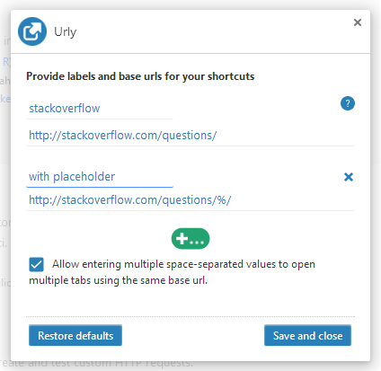
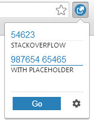

# Urly Chrome Extension
A Google Chrome Extension used to easily open links with page indicators/ticket number in a new tab.

# Configuration
1. Install this Extension from [Chrome WebStore](https://chrome.google.com/webstore/detail/tablinker/dciojklibcmcjpfchhelbeaognffhibi)
2. Configure it by adding base URL and a label
3. Type what needs to be replaced in base URL or added at the end and press Enter (or "Go")
4. New tab will be opened on that link

# Screenshots


You can define multiple base urls. In that way you will get multiple entry text fields on a popup and you will be able to open several tabs with different webpages. In this example two base urls are set. Both point to Stack Overflow page and show two ways of defining base links:

1. in first one your input would be appended at the end
2. in second one your input will replace placeholder ' **%** ' 



Entering text and pressing Enter or "Go" will open new tab. In this example 3 tabs will be opened. First input opens one tab, and second input will be split on space into two separate entries and will be displayed on two separate tabs.

# Changelog
Please see the [Changelog](https://github.com/wojciechplesiak/urly-web-extension/wiki/Changelog) page to see what's recently changed.

# License
```
The MIT License (MIT)

Copyright (c) 2016 Wojciech Plesiak

Permission is hereby granted, free of charge, to any person obtaining a copy
of this software and associated documentation files (the "Software"), to deal
in the Software without restriction, including without limitation the rights
to use, copy, modify, merge, publish, distribute, sublicense, and/or sell
copies of the Software, and to permit persons to whom the Software is
furnished to do so, subject to the following conditions:

The above copyright notice and this permission notice shall be included in all
copies or substantial portions of the Software.

THE SOFTWARE IS PROVIDED "AS IS", WITHOUT WARRANTY OF ANY KIND, EXPRESS OR
IMPLIED, INCLUDING BUT NOT LIMITED TO THE WARRANTIES OF MERCHANTABILITY,
FITNESS FOR A PARTICULAR PURPOSE AND NONINFRINGEMENT. IN NO EVENT SHALL THE
AUTHORS OR COPYRIGHT HOLDERS BE LIABLE FOR ANY CLAIM, DAMAGES OR OTHER
LIABILITY, WHETHER IN AN ACTION OF CONTRACT, TORT OR OTHERWISE, ARISING FROM,
OUT OF OR IN CONNECTION WITH THE SOFTWARE OR THE USE OR OTHER DEALINGS IN THE
SOFTWARE.
```

[here]: https://chrome.google.com/webstore